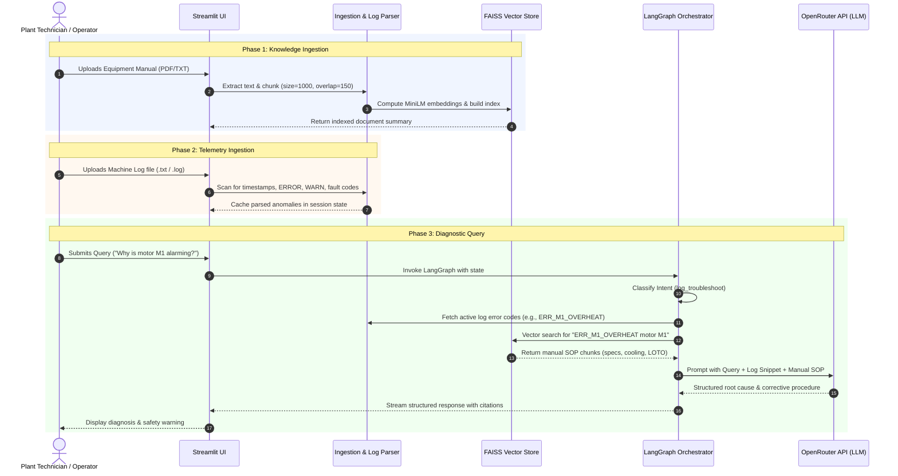

# System Architecture & Tech Stack
## Project: Chatbot - Industrial Operations & Fault Troubleshooting Assistant

---

## 1. Architectural Topology

Chatbot follows a clean, modular multi-tier architecture designed for local execution and high-performance inference via OpenRouter.

```
┌────────────────────────────────────────────────────────────────────────┐
│                          PRESENTATION LAYER                            │
│                 Streamlit Web Application (app.py)                     │
│  ┌───────────────────────────┐         ┌────────────────────────────┐  │
│  │  Sidebar Configuration    │         │     Main Viewport Tabs     │  │
│  │  - OpenRouter API Setup   │         │  1. Diagnostic Chat        │  │
│  │  - Knowledge Manuals Dock │         │  2. Log Inspector Table    │  │
│  │  - Telemetry Log Dock     │         │  3. Manuals Knowledge Base │  │
│  └───────────────────────────┘         └────────────────────────────┘  │
└─────────────────────────────────▲──────────────────────────────────────┘
                                  │
                                  ▼
┌────────────────────────────────────────────────────────────────────────┐
│                        AGENTIC ORCHESTRATION                           │
│                      LangGraph State Machine                           │
│  ┌──────────────────────────────────────────────────────────────────┐  │
│  │  Intent Router -> [RAG Retriever | Log Analyzer] -> Synthesizer  │  │
│  └──────────────────────────────────────────────────────────────────┘  │
└───────────────▲───────────────────────────────────────▲────────────────┘
                │                                       │
                ▼                                       ▼
┌─────────────────────────────────┐   ┌──────────────────────────────────┐
│      KNOWLEDGE RETRIEVAL        │   │       TELEMETRY & LOG PARSER     │
│  - Text Extraction (pypdf)      │   │  - Timestamp & Level Detector    │
│  - Chunking (RecursiveSplitter) │   │  - Anomaly & Fault Extractor     │
│  - Local Embeddings (MiniLM-L6) │   │  - Log Buffer Windowing          │
│  - FAISS Vector Index (Local)   │   │  - Key Metrics Summarizer        │
└─────────────────────────────────┘   └──────────────────────────────────┘
                │                                       │
                └───────────────────┬───────────────────┘
                                    │
                                    ▼
┌────────────────────────────────────────────────────────────────────────┐
│                         MODEL INFERENCE LAYER                          │
│                   OpenRouter Unified AI Endpoint                       │
│    (Claude 3.5 Sonnet / DeepSeek V3 / DeepSeek R1 / GPT-4o-mini)       │
└────────────────────────────────────────────────────────────────────────┘
```

---

## 2. Technology Stack Selection & Comparative Justification

### 2.1 User Interface: **Streamlit**
- **Evaluation**: We compared Streamlit against FastAPI + React, Chainlit, and Gradio.
- **Why Streamlit Won**:
  - **Single-Stack Simplicity**: Entire UI and server state managed in pure Python. No Node.js/npm dependencies, build steps, or CORS configuration.
  - **Native File Uploaders**: Multi-file drag-and-drop support for both PDFs and TXT files out of the box (`st.file_uploader`).
  - **Session State Persistence**: Seamlessly keeps uploaded vector indexes, log tables, and chat conversations in memory per user session.
  - **Data Visualization**: Built-in support for rendering tabular log data, metrics cards (`st.metric`), code blocks, and markdown alerts.

### 2.2 Orchestration Engine: **LangGraph**
- **Evaluation**: We evaluated raw LangChain chains vs AutoGen vs CrewAI vs LangGraph.
- **Why LangGraph Won**:
  - **Explicit, Deterministic State**: Unlike multi-agent autonomous "swarm" frameworks that can get stuck in infinite conversation loops or generate uncontrollable token costs, LangGraph provides a formal, cyclic or acyclic directed graph with a well-defined `TypedDict` state.
  - **Clean Debuggability**: Nodes are simple Python functions `(state) -> new_state`. Easy to unit test and inspect.
  - **Conditional Routing**: Cleanly switches between simple manual retrieval and deep log error analysis based on detected user intent.

### 2.3 Vector Database: **FAISS (faiss-cpu)**
- **Evaluation**: Evaluated FAISS vs ChromaDB vs Qdrant vs Pinecone.
- **Why FAISS Won**:
  - **Zero External Dependencies**: Pure C++ library with Python bindings running locally in memory or saved to a single directory (`faiss_index/`).
  - **Blazing Fast**: Nanosecond-level similarity search for typical industrial manual corpuses (10 to 500 pages).
  - **Air-Gapped & Private**: Works without outbound network requests or hosted database credentials.

### 2.4 Embedding Engine: **Local Sentence-Transformers (`all-MiniLM-L6-v2`)**
- **Evaluation**: Evaluated local HuggingFace embeddings vs OpenAI `text-embedding-3-small`.
- **Why Local MiniLM Won**:
  - **Completely Free & Offline**: No API quota usage, rate limits, or costs incurred during ingestion of large manuals.
  - **Low Resource Footprint**: 384-dimensional embeddings that load on standard CPU in < 1 second.
  - *Optional fallback*: Users can switch to OpenAI/OpenRouter embeddings if local model downloading is restricted.

### 2.5 LLM Provider: **OpenRouter API**
- **Why OpenRouter**:
  - **Single Key, All Top Models**: Connects seamlessly using the standard OpenAI client SDK (`base_url="https://openrouter.ai/api/v1"`).
  - **Model Flexibility**: Plant managers can select cost-effective fast models (e.g., `meta-llama/llama-3.1-8b-instruct`, `openai/gpt-4o-mini`) or elite reasoning models for complex machinery diagnostics (e.g., `anthropic/claude-3.5-sonnet`, `deepseek/deepseek-chat`).

---

## 3. Data Flow & Processing Lifecycle



---

## 4. Storage & State Management Strategy

1. **Session State (`st.session_state`)**:
   - `vector_store`: Loaded FAISS vector store instance.
   - `indexed_docs_meta`: List of uploaded manual files with chunk counts.
   - `active_logs_content`: Raw text of uploaded telemetry log.
   - `parsed_faults`: Structured list of detected errors and timestamps.
   - `chat_history`: Conversation messages list for the current session.
2. **Disk Persistence (Optional / Cache)**:
   - `./storage/faiss_index/`: Local FAISS index files (`index.faiss` and `index.pkl`) saved to disk so uploaded manuals persist across app restarts without re-embedding.
   - `./storage/uploads/`: Staged directory for uploaded files.

---

## 5. Security & Environment Configuration

- **API Key Management**: Supports both `.env` file configuration (`OPENROUTER_API_KEY=...`) and on-the-fly password-masked input directly in the Streamlit sidebar.
- **Data Privacy**: No company manuals or operational telemetry logs are sent to third parties other than the prompt sent to the user-selected OpenRouter model endpoint. FAISS vector embeddings remain entirely local.
