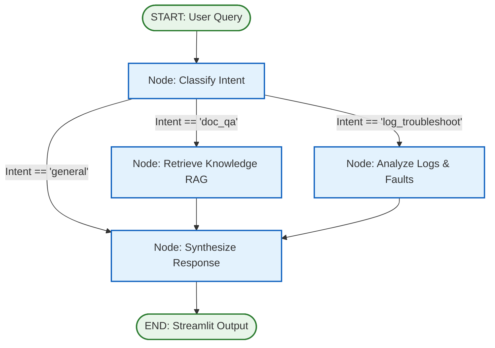

# LangGraph Workflow Design
## Project: Chatbot - Industrial Operations & Fault Troubleshooting Assistant

---

## 1. Design Philosophy: Logical, Basic & Transparent

A key design requirement for this project is:
> **"The LangGraph loop also needed to be very logical and basic, don't complicate it."**

Many multi-agent setups become fragile by adding circular debate loops, dynamic tool loops with unpredictable retries, or complex nested subgraphs. For an industrial plant environment, reliability and determinism are paramount.

Our LangGraph workflow uses a **clean, transparent 3-branch state machine**:
1. Single intent classification step.
2. Targeted execution node (Knowledge Retrieval vs Log Anomaly Analysis vs Direct Handling).
3. Single response synthesis step.

No infinite loops, no recursive token burns, and straightforward state transitions that any software engineer can maintain.

---

## 2. Graph State Schema

The state carries only the exact data required across node transitions:

```python
from typing import TypedDict, List, Dict, Optional, Any
from langchain_core.messages import BaseMessage

class IndustrialAgentState(TypedDict):
    # User Inputs
    query: str                                # The user's prompt or question
    chat_history: List[BaseMessage]           # Prior conversation messages
    
    # Active Session Context
    active_logs: Optional[str]                # Raw text of uploaded telemetry log
    has_logs: bool                            # True if log file is loaded in session
    has_manuals: bool                         # True if FAISS vector index contains documents
    
    # Routing & Processing State
    intent: str                               # "doc_qa" | "log_troubleshoot" | "general"
    extracted_faults: List[str]               # Fault codes/errors identified in logs
    retrieved_manual_chunks: List[str]        # Relevant excerpts retrieved from FAISS
    sources: List[Dict[str, Any]]             # Document names and page numbers cited
    
    # Final Output
    final_response: str                       # Markdown-formatted diagnostic answer
```

---

## 3. Workflow Graph Topology



---

## 4. Node Specifications

### 4.1 Node 1: `classify_intent`
- **Purpose**: Determine what the user needs without executing unnecessary vector searches.
- **Routing Rules**:
  1. If `active_logs` exists and the user mentions words like *"error"*, *"fault"*, *"log"*, *"why did it stop"*, *"alarm"*, *"status"*, or *"diagnose"* $\rightarrow$ `intent = "log_troubleshoot"`.
  2. If the user asks about specifications, wiring, parameters, maintenance schedules, or SOP rules $\rightarrow$ `intent = "doc_qa"`.
  3. Simple greetings or general questions without domain terms $\rightarrow$ `intent = "general"`.
- **Implementation**: Fast keyword/heuristic classifier with fallback to a lightweight LLM call if ambiguous.

### 4.2 Node 2: `retrieve_knowledge`
- **Purpose**: Retrieve ground truth information from uploaded equipment manuals (PDF/TXT) via FAISS.
- **Execution Steps**:
  1. Formulate search query from user question and relevant chat history.
  2. Query FAISS index for top $k=4$ most similar text chunks.
  3. Populate `retrieved_manual_chunks` and record metadata (filename, page/section).
- **Fallback**: If no manuals are loaded (`has_manuals == False`), record notice: *"No equipment manuals currently indexed."*

### 4.3 Node 3: `analyze_logs`
- **Purpose**: Cross-reference active operational logs with equipment manuals to diagnose root causes.
- **Execution Steps**:
  1. Scan `active_logs` for lines matching error patterns (`ERROR`, `WARN`, `FAIL`, `ALARM`, `CRITICAL`, or regex `[A-Z0-9_-]{3,}_[0-9]{3,}`).
  2. Extract the last $N$ relevant fault lines and anomalous events.
  3. Query FAISS vector index using the extracted fault codes (e.g., `"Troubleshooting procedure for ERR_OVERHEAT_04"`).
  4. Aggregate both the raw log anomaly snippets and the corresponding manual repair steps into state.
- **Fallback**: If no logs are loaded, notify the user to upload active logs or paste error codes.

### 4.4 Node 4: `synthesize_response`
- **Purpose**: Assemble the final grounded response using OpenRouter.
- **Prompt Structure**:
  ```markdown
  You are Chatbot, an expert Industrial Diagnostics Assistant.
  Answer the user's query strictly based on the provided context.
  
  [CURRENT OPERATING LOGS]
  {extracted_faults / log_summary}
  
  [EQUIPMENT MANUALS / SOPS]
  {retrieved_manual_chunks}
  
  [INSTRUCTIONS]
  1. If a fault is diagnosed:
     - Name the fault and timestamp from the logs.
     - State the root cause as explained in the equipment manuals.
     - Provide clear, numbered corrective actions.
     - Highlight critical safety procedures (e.g., LOTO, electrical hazard).
  2. If the answer is not in the manuals, explicitly state that it is not documented.
  3. Always cite the manual name and page/section where available.
  ```

---

## 5. LangGraph Construction (Reference Python Code)

Below is the concrete implementation blueprint for `agent/graph.py`:

```python
from langgraph.graph import StateGraph, START, END
from typing import Literal

def build_industrial_graph(vector_store, llm_client):
    builder = StateGraph(IndustrialAgentState)

    # 1. Define Nodes
    builder.add_node("classify_intent", classify_intent_node)
    builder.add_node("retrieve_knowledge", lambda state: retrieve_knowledge_node(state, vector_store))
    builder.add_node("analyze_logs", lambda state: analyze_logs_node(state, vector_store))
    builder.add_node("synthesize_response", lambda state: synthesize_response_node(state, llm_client))

    # 2. Define Conditional Router
    def route_intent(state: IndustrialAgentState) -> Literal["retrieve_knowledge", "analyze_logs", "synthesize_response"]:
        intent = state.get("intent", "general")
        if intent == "doc_qa":
            return "retrieve_knowledge"
        elif intent == "log_troubleshoot":
            return "analyze_logs"
        return "synthesize_response"

    # 3. Add Edges
    builder.add_edge(START, "classify_intent")
    builder.add_conditional_edges(
        "classify_intent",
        route_intent,
        {
            "retrieve_knowledge": "retrieve_knowledge",
            "analyze_logs": "analyze_logs",
            "synthesize_response": "synthesize_response"
        }
    )
    builder.add_edge("retrieve_knowledge", "synthesize_response")
    builder.add_edge("analyze_logs", "synthesize_response")
    builder.add_edge("synthesize_response", END)

    # 4. Compile into executable workflow
    return builder.compile()
```

---

## 6. Edge Cases & Resilience

| Scenario | Handled By | Behavior |
|---|---|---|
| **No Manuals Uploaded** | `retrieve_knowledge` | Skips vector search, returns clean notice advising user to upload PDF/TXT manuals. |
| **No Logs Uploaded** | `analyze_logs` | Prompts user to drop a log file or paste recent telemetry into the chat. |
| **OpenRouter API Error / Timeout** | `synthesize_response` | Catches `APIConnectionError` / `RateLimitError` and provides friendly offline diagnostic guidance. |
| **Irrelevant / Out-of-Domain Query** | `synthesize_response` | Politely steers user back to industrial equipment, operations, and logs. |
